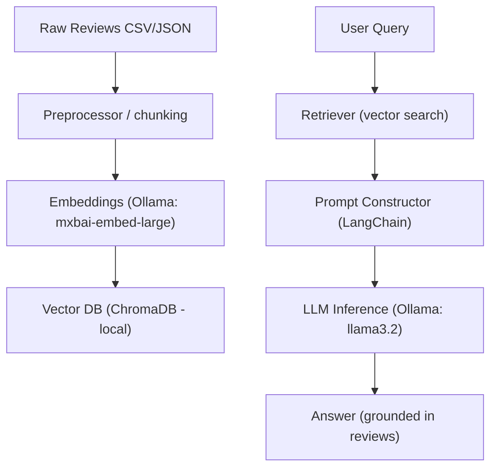

# 🍕 RAG Agent for Pizza Restaurant Reviews

[]()
[]()
[]()
[]()
[]()

A **Retrieval-Augmented Generation (RAG) Agent** that answers questions about pizza restaurants using customer reviews. It combines local embeddings + vector retrieval (ChromaDB) and a local LLM (Ollama) to produce answers grounded in the original review text and avoids hallucination by explicitly returning **"I don't know"** when the reviews do not contain the requested information.

---

## 📌 Highlights
- Local-only inference and embeddings (Ollama)
- Vector store persistence (ChromaDB)
- LangChain orchestration for retrieval + generation
- Safety-first: model instructed to respond "I don't know" when information is absent
- Small, testable CLI and straightforward configuration

---

## 🏗 System Architecture



---

## 🛠 Tech Stack
- Python 3.10+
- Ollama (local model hosting & embeddings) — models: `llama3.2`, `mxbai-embed-large`
- ChromaDB (vector store, local persistence)
- LangChain (retriever + chain orchestration)
- Typical extras: pandas, tqdm, typer or argparse for CLI

---

## 📂 Project Structure
```plaintext
review-rag-agent/
├─ app/              
│  ├─ __init__.py
│  ├─ main.py                 
│  └─ vector.py
├─ data/                      
│  └─ restaurant_reviews.csv  
├─ tests/
│  └─ test_vector.py
├─ vector_store/
├─ .env              
├─ .gitignore
├─ __init__.py
├─ conftest.py
├─ LICENSE
├─ README.md
└─  requirements.txt
```

---

## 🚀 Quickstart / Getting Started

### Prerequisites
- Python 3.10+
- Ollama (daemon running locally) — https://ollama.com
- Git
- Optional: virtualenv

### 1. Clone repository
```bash
git clone https://github.com/your-username/review-rag-agent.git
cd review-rag-agent
```

### 2. Install Ollama and pull required models
Start the Ollama daemon (see Ollama docs), then run:

```bash
ollama pull llama3.2
ollama pull mxbai-embed-large
```

### 3. Create and activate virtual environment, install deps
```bash
python -m venv .venv
# macOS / Linux
source .venv/bin/activate
# Windows
# .venv\Scripts\activate

pip install --upgrade pip
pip install -r requirements.txt
```

Ensure `requirements.txt` includes:
- langchain
- langchain-ollama
- langchain-chroma
- pandas
- python-dotenv
- pytest


### 5. Create a .env file containing
```bash
DB_PATH = "vector_store/chroma_langchain_db"
DATA_PATH = "data/restaurant_reviews.csv"
EMBED_MODEL = "mxbai-embed-large"
LLM_MODEL = "llama3.2"
```

---

### 6. Run the agent (ask questions)
```bash
python app/main.py
```

---

Examples:
- Input: "How are the vegan options?"  
  - If reviews mention vegan pizza / vegan cheese → grounded answer + source passage IDs.
- Input: "Do they have a rooftop terrace?"  
  - If not found → "I don't know — not found in reviews"

Why: explicit instruction reduces hallucinations and makes results auditable.

---

## 🗺️ Future Roadmap
- [ ] FastAPI server mode (`/health`, `/ingest`, `/query`) — acceptance: OpenAPI + example curl
- [ ] Auth & rate limiting (API keys or OAuth + SlowAPI) — acceptance: env-configurable rate limits + documented auth
- [ ] Unit & integration test suite — acceptance: CI passes on PRs
- [ ] Minimal React UI for interactive querying — acceptance: dev server + show source snippets
- [ ] Refactor `vector.py` → `embeddings.py`, `persistence.py`, `retriever.py` — acceptance: same external behavior + tests

---

## ⚠️ Resource & security notes
- Local models and embeddings can use substantial RAM/CPU. For moderate datasets, 8–16 GB RAM is recommended. Reduce concurrency/chunk sizes for low-RAM machines.
- Sanitize PII before ingesting reviews if present.
- Do not expose local Ollama endpoints publicly without proper auth and rate limiting.

---

## 📜 License & credits
- License: MIT — add `LICENSE` to repo root.
- Built with: Ollama, LangChain, ChromaDB

---

